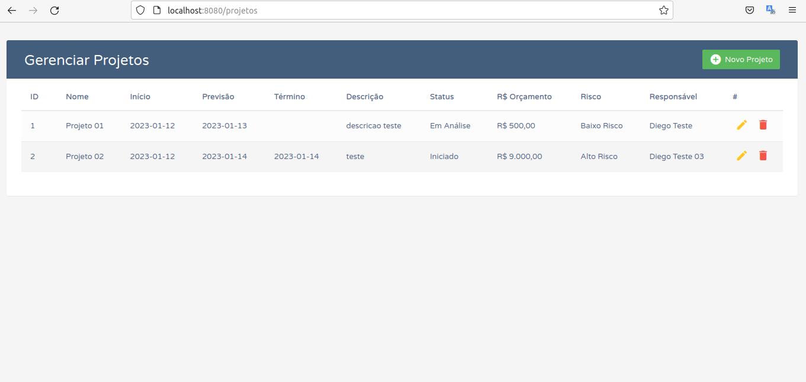
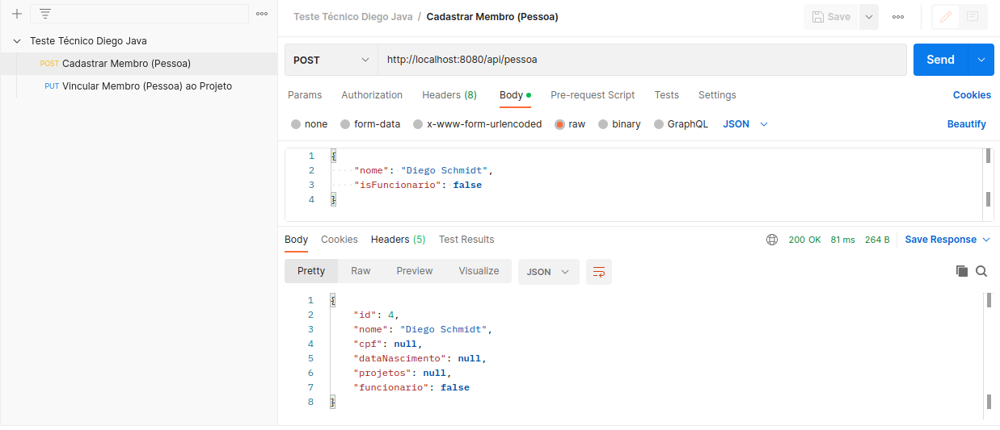

## Executando o projeto

Requisitos:
* Java 17
* PostgreSQL com usuario "postgres" e senha "123456" rodando na porta 5432 e um database chamado "teste-diego" criado

Acessar a pasta do projeto e rodar o comando:

```
./mvnw spring-boot:run
```

## Informações

* A página inicial com lista de projetos fica em: [http://localhost:8080/projetos](http://localhost:8080/projetos)
* A URL Base do WebService é: [http://localhost:8080/api](http://localhost:8080/api) e tem dois endpoints: [http://localhost:8080/api/pessoa](http://localhost:8080/api/pessoa) e [http://localhost:8080/api/pessoa/1/projeto/1](http://localhost:8080/api/pessoa/1/projeto/1) - Dentro do projeto na pasta chamada **postman** tem uma collection pronta para facilitar, se preferir.

## Observações

* Boa parte do layout do bootstrap foi retirado da internet para acelerar o desenvolvimento.

## Projeto rodando



```